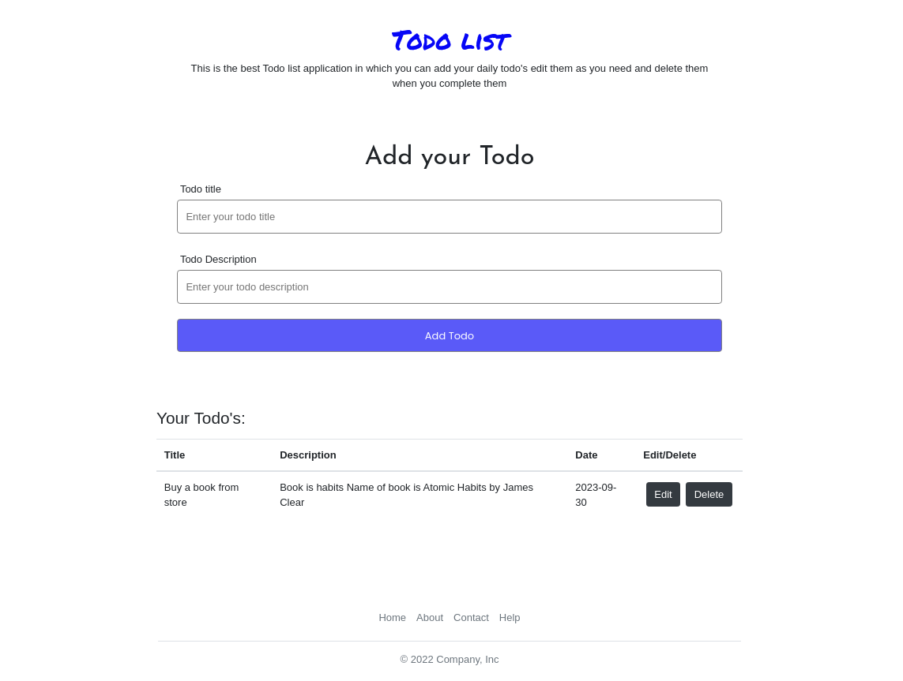

# ToDo List Website



## Introduction

Welcome to the ToDo List Website! This web application is designed to help you stay organized and manage your tasks effectively. With its user-friendly interface and powerful features, you can easily keep track of your to-do items and boost your productivity.

## Features

- **Task Creation**: Quickly add new tasks with titles, descriptions, due dates, and priority levels.
- **Task Management**: Organize tasks by priority, due date, and category to easily prioritize and view your to-do list.
- **Task Updates**: Edit task details, change due dates, mark tasks as completed, or update their status.
- **Task Deletion**: Remove completed or unnecessary tasks to keep your list clutter-free.
- **Responsive Design**: The website is responsive and works seamlessly on both desktop and mobile devices.

## Getting Started

To run this ToDo List website locally on your machine, follow these steps:

1. Clone this repository to your local machine:

   ```bash
   git clone https://github.com/geekclick/Todo-List
Navigate to the project directory:

```bash
cd todo-list-website
```
Install the required dependencies (ensure you have Python and Flask installed):

```bash
pip install -r requirements.txt
```
Start the development server:

```bash
python app.py
```
Open your web browser and go to http://localhost:5000 to access the ToDo List Website.

Contributing
Contributions are welcome! If you'd like to contribute to this project, please follow these guidelines:

Fork the repository and create your branch from main.
Create a clear and descriptive pull request explaining your changes.
Ensure your code is well-documented and adheres to the project's coding style.
License
This project is licensed under the MIT License - see the LICENSE file for details.